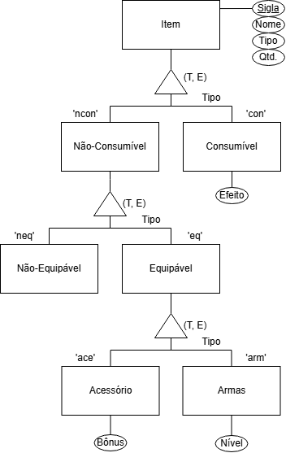

# Modelo Entidade-Relacionamento

---

## Introdução

De acordo com **Silberschatz (2006, p.13)**, um *Modelo Entidade-Relacionamento (MER)* serve para delinear objetos do mundo real. Esses objetos são denominados *Entidades* e as associações existentes entre esses ojetos são denominadas *Relações*. Dessa forma, o conjunto de entidades é denominado *Conjunto de Entidades* e o conjunto das relações é denominado *Conjunto de Relacionamentos*.  

Cada entidade possui um *atributo* ou um conjunto de atributos que são usados para identificar as características dessa entidade.

Um *Diagrama Entidade-Relacionamento (DER)* é um esquema para representar graficamente um MER. Ele é composto por:  

- **Retângulos**: Representam os conjuntos de entidades;  
- **Elipses**: Representam os atributos;  
- **Losângos**: Representam o conjunto de relacionamento entre as entidades;  
- **Linhas**: Une os atributos às entidades e o conjunto de entidades aos relacionamentos;  
- **Triângulos**: Conjunto de relacionamentos do tipo generalização.

O conjunto de relacionamento pode ser também do tipo *generalização*. A generalização é um relacionamento que liga um conjunto de entidades de nível superior à um conjunto de entidades de nível inferior, que compartilham os atributos das entidades superiores. A generalização pode ser classificada de acordo com o tipo de restrição. Ela pode ser de (**Silberschatz (2006, p.194)**):  

- **Participação Total (T)**: Uma entidade de nível superior deve pertencer a pelo menos uma entidade de nível inferior;  
- **Participação Parcial (P)**: Uma entidade de nível superior pode não pertencer a nenhuma entidade de nível inferior.  

E também:  

- **Exclusivo (E)**: Onde a entidade de nível superior não pode pertence a mais de uma entidade de nível inferior;  
- **Sobreposição (S)**: Onde a entidade de nível superior pode pertence a várias entidades de nível inferior.  

Assim sendo, a generalização pode aparecer de quatro formas:  

- Total Exclusivo (T, E);
- Total Sobreposto (T, S);
- Parcial Exclusivo (P, E);
- Parcial Sobreposto (P, S).

E, por fim, "Agregação é uma abstração por meio da qual os relacionamentos são tratados como entidades de nível superior" **Silberschatz (2006, p.196)**. Ela é representada por uma caixa retangular que envolve os conjuntos de entidades e seus relacionamentos.

## Metodologia

Para o desenvolvimento do Modelo Entidade-Relacionamento (MER) do **Marventura**, foi necessário seguir uma abordagem estruturada que garantisse clareza e organização ao longo do processo. Inicialmente, foi realizado um estudo aprofundado sobre modelagem de dados e, mais especificamente, sobre o modelo entidade-relacionamento. Foram analisados conceitos fundamentais como entidades, relacionamentos, atributos, cardinalidade e normalização. Esse estudo permitiu definir uma base sólida para a construção de um modelo coerente e aderente às boas práticas de design de banco de dados.

Com o embasamento teórico estabelecido, foi iniciada a etapa de definição das características do jogo. Neste ponto, foram tomadas decisões importantes relacionadas ao contexto narrativo e mecânico do jogo, como o gênero, os personagens principais, ambientação e elementos-chave de jogabilidade. Esse direcionamento forneceu um norte para identificar quais entidades e relações seriam relevantes para o sistema do jogo.

Para facilitar tanto a visualização quanto a modelagem do MER, optou-se por dividir o modelo em temas. Essa divisão temática permitiu organizar o projeto em partes menores, cada uma representando um domínio específico do jogo, como personagens, itens, missões, localidades e progressão do jogador. Essa segmentação foi essencial para reduzir a complexidade visual do diagrama completo, além de ajudar a manter uma estrutura lógica e modular, facilitando futuras expansões e manutenções.

Essa abordagem incremental e organizada tornou possível construir um modelo claro, consistente e alinhado com os objetivos do jogo, ao mesmo tempo em que respeita os princípios da boa modelagem de dados.

## Diagrama Entidade-Relacionamento

A **Figura 1** abaixo apresenta o diagrama Entidade-Relacionamento pensado para representar os itens do inventário do jogador, que vão desde os itens equipáveis e não-equipáveis, como moedas (não-equipável) e espadas (equipável), ambos não consumíveis, e itens consumíveis, como os itens de recuperação de vida e energia.

  
Figura 1 – Diagrama Entidade-Relacionamento dos Itens do Inventário

  

    
<strong>Figura 1 – Diagrama Entidade-Relacionamento dos Itens do Inventário</strong>

    
    
Autor: <a href="https://github.com/MatheusHenrickSantos">Matheus Henrick</a>.

  

## 📚 Bibliografia

> SILBERSCHATZ, Abraham; KORTH, Henry F.; SUDARSHAN, S. Fundamentos de bases de datos. 5. ed. Madrid: McGraw-Hill España, 2006.

## 📑 Histórico de Versões

| Versão | Descrição | Autor(es) | Data de Produção | Revisor(es) | Data de Revisão | 
| :----: | --------- | --------- | :--------------: | ----------- | :-------------: |
| `1.0` | Criação do documento | [Matheus Henrick](https://github.com/MatheusHenrickSantos) | 17/04/2025 |  |  |
