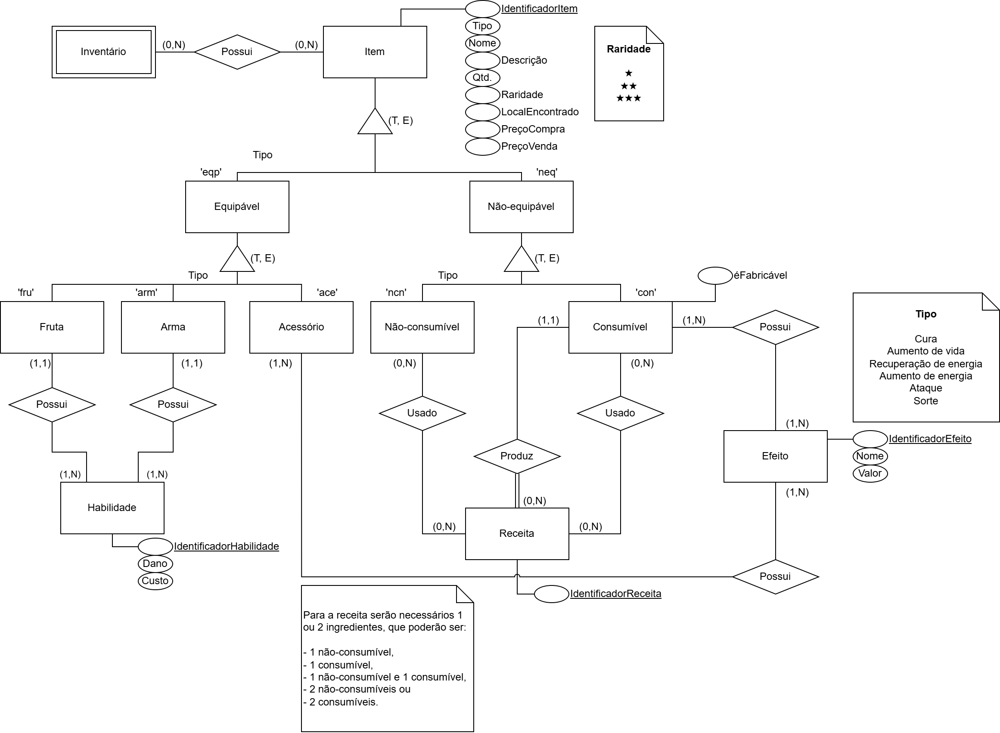

# Modelo Entidade-Relacionamento

---

## Introdução

De acordo com **Silberschatz (2006, p.13)**, um *Modelo Entidade-Relacionamento (MER)* serve para delinear objetos do mundo real. Esses objetos são denominados *Entidades* e as associações existentes entre esses ojetos são denominadas *Relações*. Dessa forma, o conjunto de entidades é denominado *Conjunto de Entidades* e o conjunto das relações é denominado *Conjunto de Relacionamentos*.  

Cada entidade possui um *atributo* ou um conjunto de atributos que são usados para identificar as características dessa entidade.

Um *Diagrama Entidade-Relacionamento (DER)* é um esquema para representar graficamente um MER. Ele é composto por:  

- **Retângulos**: Representam os conjuntos de entidades;  
- **Elipses**: Representam os atributos;  
- **Losângos**: Representam o conjunto de relacionamento entre as entidades;  
- **Linhas**: Une os atributos às entidades e o conjunto de entidades aos relacionamentos;  
- **Triângulos**: Conjunto de relacionamentos do tipo generalização.

O conjunto de relacionamento pode ser também do tipo *generalização*. A generalização é um relacionamento que liga um conjunto de entidades de nível superior à um conjunto de entidades de nível inferior, que compartilham os atributos das entidades superiores. A generalização pode ser classificada de acordo com o tipo de restrição. Ela pode ser de (**Silberschatz (2006, p.194)**):  

- **Participação Total (T)**: Uma entidade de nível superior deve pertencer a pelo menos uma entidade de nível inferior;  
- **Participação Parcial (P)**: Uma entidade de nível superior pode não pertencer a nenhuma entidade de nível inferior.  

E também:  

- **Exclusivo (E)**: Onde a entidade de nível superior não pode pertence a mais de uma entidade de nível inferior;  
- **Sobreposição (S)**: Onde a entidade de nível superior pode pertence a várias entidades de nível inferior.  

Assim sendo, a generalização pode aparecer de quatro formas:  

- Total Exclusivo (T, E);
- Total Sobreposto (T, S);
- Parcial Exclusivo (P, E);
- Parcial Sobreposto (P, S).

E, por fim, "Agregação é uma abstração por meio da qual os relacionamentos são tratados como entidades de nível superior" **Silberschatz (2006, p.196)**. Ela é representada por uma caixa retangular que envolve os conjuntos de entidades e seus relacionamentos.

## Metodologia

Para o desenvolvimento do Modelo Entidade-Relacionamento (MER) do **Marventura**, foi necessário seguir uma abordagem estruturada que garantisse clareza e organização ao longo do processo. Inicialmente, foi realizado um estudo aprofundado sobre modelagem de dados e, mais especificamente, sobre o modelo entidade-relacionamento. Foram analisados conceitos fundamentais como entidades, relacionamentos, atributos, cardinalidade e normalização. Esse estudo permitiu definir uma base sólida para a construção de um modelo coerente e aderente às boas práticas de design de banco de dados.

Com o embasamento teórico estabelecido, foi iniciada a etapa de definição das características do jogo. Neste ponto, foram tomadas decisões importantes relacionadas ao contexto narrativo e mecânico do jogo, como o gênero, os personagens principais, ambientação e elementos-chave de jogabilidade. Esse direcionamento forneceu um norte para identificar quais entidades e relações seriam relevantes para o sistema do jogo.

Para facilitar tanto a visualização quanto a modelagem do MER, optou-se por dividir o modelo em temas. Essa divisão temática permitiu organizar o projeto em partes menores, cada uma representando um domínio específico do jogo, como personagens, itens, missões, localidades e progressão do jogador. Essa segmentação foi essencial para reduzir a complexidade visual do diagrama completo, além de ajudar a manter uma estrutura lógica e modular, facilitando futuras expansões e manutenções.

Essa abordagem incremental e organizada tornou possível construir um modelo claro, consistente e alinhado com os objetivos do jogo, ao mesmo tempo em que respeita os princípios da boa modelagem de dados.

## Diagrama Entidade-Relacionamento

A **Figura 1** abaixo apresenta o diagrama Entidade-Relacionamento pensado para representar os itens do inventário do jogador, que vão desde os itens equipáveis e não-equipáveis, como moedas (não-equipável) e espadas (equipável), ambos não consumíveis, e itens consumíveis, como os itens de recuperação de vida e energia.

  
Figura 1 – Diagrama Entidade-Relacionamento dos Itens do Inventário
    <svg class="arrow-icon" xmlns="http://www.w3.org/2000/svg" viewBox="0 0 24 24" width="24" height="24"><path d="M8.59,16.58L13.17,12L8.59,7.41L10,6L16,12L10,18L8.59,16.58Z" /></svg>
  

  

    
<strong>Figura 1 – Diagrama Entidade-Relacionamento dos Itens do Inventário</strong>

    
    
Autor: <a href="https://github.com/MatheusHenrickSantos">Matheus Henrick</a>.

  

Os efeitos *Cura* e *Recuperação de energia* são aqueles obtidos através de itens consumíveis e são usados para recuperar os pontos que foram perdidos desses atributos, sem ultrapassar o máximo, enquanto os efeitos *Aumento de vida* e *Aumento de energia* são aplicáveis aos acessórios e servem para aumentar o limite máximo desses atributos. Ademais, *Ataque* e *Sorte* aplicam-se a ambos. Todos esses efeitos possuem três tipos: pequeno, médio e grande, que estão relacionados com as raridades ★, ★★ e ★★★, respectivamente, com excessão de *Sorte* que possui apenas um nível.

---

A **Figura 2** abaixo apresenta o diagrama Entidade-Relacionamento com foco nos personagens que abarca tanto o personagem jogável, que é o próprio jogador, quanto os personagens não-jogáveis, que são os inimigos e os habitantes.

  
Figura 2 – Diagrama Entidade-Relacionamento dos Personagens
    <svg class="arrow-icon" xmlns="http://www.w3.org/2000/svg" viewBox="0 0 24 24" width="24" height="24"><path d="M8.59,16.58L13.17,12L8.59,7.41L10,6L16,12L10,18L8.59,16.58Z" /></svg>
  

  

    
<strong>Figura 2 – Diagrama Entidade-Relacionamento dos Personagens</strong>

    <iframe src="https://viewer.diagrams.net/?lightbox=1&nav=1&title=Diagrama%20de%20personagem.drawio&dark=0#R%3Cmxfile%20pages%3D%222%22%3E%3Cdiagram%20id%3D%227o4wIIwqFHXamwNt6cy-%22%20name%3D%22DER%22%3E7T3ZdqJMt0%2BT1f%2B5MIt5uEzM3JmHTvq76YWKSqJgEGOSpz%2BgYKRqUyBWFdCdrB4iAuKe570jt8fvx741GV54PXu0Iwm99x35YEeSREnRwv%2BiIx%2FLI7qiLw8MfKcXn%2FR14M75tOODQnx05vTsaerEwPNGgTNJH%2Bx6rmt3g9Qxy%2Fe9efq0vjdKf%2BrEGtjYgbuuNcKPPjq9YLg8akj61%2FET2xkMk08WNXP5zthKTo6%2FyXRo9bz52iH5cEdu%2B54XLH8bv7ftUQS8BC7L644y3l09mG%2B7QZELHi%2FF0chX1OfZuHv3fHl0dCkftpT42YKP5AvbvfD7xy89Pxh6A8%2B1RodfR%2Fd9b%2Bb27OiuQvjq65xzz5uEB8Xw4LMdBB8xMq1Z4IWHhsF4FL9rvzvB09rvv6Nb7Upq%2FPLgPb714sVH8sIN%2FI%2Bn9RfLy9Tk5ddli1df1%2FX2IjoIX7qeGz3%2FNLD84MgZjeIzcEDGsJ16M78bg6X3NDu4mTy%2Fi%2F%2B9Pf6nXHyc%2Fnf11koI0vIHdkCAsrQ8LwLt2gfEaDq2vbEdPnF4gm%2BPrMB5S5OeFVPwYHXeF5LDX2I8wzgnPfWbNZrFn3Rt%2B9MQgwN7jJHDfOgE9t3EWsBhHvJ4GpXWyBm44e%2FdEHa2TwLmm%2B0H9jvx68fvmnLMMbHIkIX49fyLAcXk2HCN%2BRRhe4idjl%2BuXfGmMw%2Fk2Y12cvtHHBoAxCphG4aULOGUTKId%2FpT80%2F%2BUbnqBp3aCB%2Flgag2GhtvS%2FkW8gBSq0sbL4tLwa1kfaydMPMcNpmt3vo4OrHGukeZcBVVJyPn6tudrAkJDyyf%2BoqjVVy9PZHqVKjLWb7GSFMkaMnwRSnIn%2FMKRKEa05pei%2FJ3Sk%2Fy1ZlGaVhpJ07JOPJ8NjZrVyD1WtEWL%2BhPrxF%2FaCNvTbMNoUdyIGPGP08xdc%2B3HSN9LQMytJRDje2z0VKjhthQN2J1KcAsJmSSzIbJWndALPLc69ujamzqB40WU1PGCwBuHpJScsBeTWOAhlnHo7k2im43fB5FnvNuxpk531%2BrOAvtP4DuWO1hw4cJTXtK5NZ0sPdi%2B8x7xJRVbWjV2VW0NhynArxCxZlkr0q4R21XrtrXMyraWMWS0h3bfxjBSgSOyCkLE4FKNqh0RBQPWqeuMnYFXB3DJUgZbVwYuFQPXmTewep6%2FNbhiSR1eq%2B6Hf8Iv0E7%2FVcO7tpN3othG9puk9%2FTsN0X4HfSzgDezriRdSLpOJ12oZ18pZl4mkqAmEqAmkqAmQk8S%2FqFC%2FToStaie%2BnHv%2BMTqOIEVknAdxIUoVwkx0IzG4zwX1sSqA7BUs8KYGAgr3Ig6nAY7bXlnT8QAlthC%2FtAbd2bTSH6uWerx0TXjfb8CCOtqGsKSCUBYAiCsMaNGnBxPg3qEaEW9dvQo4soeg1QtgoFZbvPKpc5wmzPRtu68wqCJNUFuxCU%2Bj7KXCzmA%2Bq4ip4W%2FiRAGPR8QhonZcHLJi7I8z8aT5OEtv0udgOATDSYUtGmcRJSRQImaDhTjF6ioq8cjsrzKDP8lYbtqSE5vKMlJagUkJxZImf0tsS9RjoJfurD6kdLwFnGThWHwi0i8a%2Bi4tbv%2BLKASpKABQ0lAqJRnDIyoY9Zg9suORGJNIJYkJesDMQl3JP53HYVEJOHw%2FzCYhd8zWAh333ux297I878kfj8U9sihaQhdxx2c2%2F3oayhfR27jbxYd8kL49UcL3TF0ej3bXSiywAqszuJjhYyQWigb0KhPErKZhKqv7bnhY1rOAlm2NQ3m9jR69r7nBrH%2BE6V8d5KKrEEcIlC6AEhnJloSwb6O9PtvpNNEuok6wVA6hRHO7Re38%2Fnb9w9mB8evR1cPH%2FP2QZHEVs18mpQBGpcAbusDe8efB8cj%2F0EQ%2FcFd%2B2Vg6lqvukKaogglPfV6kM21%2FYGDxyTDmzmTqV0idsbC9NIQHQiFdlWAMyQKnPHr%2BfN28mq8eE%2Bd4ev15PenNj6GIrvOdLoIV8q1SJ6ZiDdg8gyogSDDae%2Bqb%2Ft2F08eNCG8K4qIsDZ4xndBAOOZ772u7QQ4bzcBvqaSBq%2FOE7yXz%2FPp1WNrLL1Lryc%2Ftc6l7D0m4K1HcCUvuEup3g4EBFClzqfebiv0NT2cnxdOo4pP8Lx61E%2BixV55cTGFHEfbOiwGgkqrk6zgVJu7layQG0lbEhqa4UFbBZpH%2FpaIq6xEAdc0iPlGWUEMfEdCWEdCZD1dKWwq%2BUTAKDBCUoVrFHBudS2nFp6fgpRBcY0XwxJLaIrtBTaSkvtIC%2BnGo9vX0%2BerZ%2FnBaLUM4fDmRdj72RLZKD3cAkJcKUVFEF200B4ryEVvRK%2FGQnqbX05cL%2Fjcf78VT%2FZml4%2FOU%2FPCkSurrGA4ctWnQpv%2BQHDKuG1GrBtjXsZjoPFvkS994ZbVvTPBZTrF0OhCs8Z3FijIftFE6k5WLMshUEoisvWaw9BeCZx%2BaH72PB8sQNwYwKOFtZSCZmQmjRDzN2nbyjKPx6EttZARqHm8eoMJioDILFcU4cbMzcwKUdSzenhstixuMNJvCHK0ipGDh61uLf8bNRFqALuWK2rw0qdr316kgHQvqiChkFRrNoaUqpUPXg31haG2N5743yiqWvngxVc4SjCDew0NaXO%2BjANXNmy6KYJXwTeEcuBYXL4jk0kO64b%2FTetkbPWfzkempxpHF%2F3JycBpKbHGr4%2FlryOBVyyLV7gXXFUytAQnHwJvA%2FifsIwNXuKxQd%2BeOp9rMbts8YISyYqYNqXCJXXhtENizngWWvygOythsIHcWV5APdMHu3FF4gSby5RNnHJaMgXBfq5IQbFPTabwH%2BSUwd8iosAkFY4Ubyw4BCnDc%2BYVfMA95f%2BJS8khNk9yJDxYX9HxLnYOTh%2B869lF1z8edvT5ud8tNJhtA8lRtngDHFcjECVOlGY6cPwQ1ktsJVhsjYhphXVb4fzx58%2FgdH752Nq%2FOfT37u%2F25Z%2BJCV0fU8FAo9lokqcwx%2Buylr4TO44HiQ1XU0wYfsm3pa1VnHRInNM0fsdjX1QYHgn8Vxb3Fy7OAsm%2BvZz%2FaT%2Fdnu3v94Ppx0rT0Ou%2BjFHXEnbl8GdDBGZwp4Yoeq30eChFSvO5VjCt8HWn5ESv35%2FaTGQB0G3eDO1PZKuGSQOgr2krabCN47ChBCkkDUhl2evCgFTxzlq%2FoyPpDFktx%2Fa5N2Kt3bPVe70jAUTWaBpHF6n6Lc7ReEN6vktdxpgvX0AQvUKnVpa3FCQTFw5bdTnFNBB%2BEz3ReNvKi6xqp03lhWGqqRspBQOHG8%2FcRKdUqYSaUZ4miITnsxpsgiScX1%2BBFczPH65Oz%2B8fDs8O%2F%2Bs9%2Bvfnrw7tAESZubcs%2Bw9IfUu1sUDUtCDQy5bLoTcy2ZUzgbQEGCCNSEWQGKNh7IzHdKmw8yYORa6BwjiPWbqBrawlU1TGcNx7gBsbsrirSFmTsHW0EruwDYMMV2Flw6B7EwzKM%2BlBXsJDdXUMlw493%2Fn03MBKPm7TwDxJjjRM%2BhUZidfg4CppjGl%2BbJWPoNHysppFRUvujRgbM0APSTO8ExJnNIyfgQGyNMyZcsVaDOKjRRm6ygIIU6DE0KKgVczRtAOkWcUvhFQmkcybxp14tWvUvkLYxfcXtqaukUVmHS1U2JspHzboWUUHDRQdP0%2BjtrY9uB7%2FCiRr3j08ur947SjCDbSYkYr9xaGapZC49oy7V%2Fd4%2FGC%2Fa5J%2F%2FksYuMPeKopZ0TSL3OZLrWw0SUUGOjEccA0SU7a0rpP7hRMOiTPqK%2BHBp6abzKodP9%2BO%2FDNvcLzXfXEfrKPh%2FHze%2F4Dqz2C%2BZzO2OZefDTSoW5Sf0Rvp7ArVQWICsj0sosN8%2BLn2yZ7Judw6m3R%2F99%2Bd7oW%2Bd%2ByOxzKgn3%2B82e6Pf8FOy2muyrTdCm9g3ADlKhLaUIGeT2i6CA27rTPf%2F%2BP%2BUo7vhzeP3RNnLp0%2BXUF04dvdb7pg3BuHjSavmg5wk%2BvH0Op80wFn%2BYCO4obaWrnSBZ5V%2FPHsDb7pgq18wBbyVU0GeELsx8j6VhOcxYOCDuqvWmvgXuKP7tD%2BJgu20gHb7cuRDB4vxdHIV9Tn2bh793x5dHQpH2YMMyJEg%2F%2FyyQcCEj%2FjORkJRBBu3aUmIzHAVDPmI2GI4jiiAkQUbm79cmgMd%2BG7MYHjICMQirhaiihrOYwla2%2FCF0iTebQ9bxZqksPV8bHlD5wImPLG3NAQ6uc45QjEGx4nvFyg6%2BDNHjWNBzjC0rqaDEZvpx%2Fde3vw8%2BpsOD25fwd0cmNgiW4X5ClPQFji6vMyvHPNoYgPMeO4yKbXfzwZm2enTzPvj%2FD%2BePlT%2BhABkrwLDe66wxHlbJWjjQCCEafGHUkbReqkE%2F4yiH4B1N3yjPADVyclx3rOW4FDHZ9wUtvz%2FNCgtCJTRXha%2BzDyvVOX%2FSZfVuwoQkmJKne9YKHZl%2F6bJJQgLQqUZCByTSw6LVtE%2B9Gp0RJub7a9T8cNP9yvxYBxUa5ywjg8ShsAWQiwhu6WMpCdBxrP3UcgfHGSvLXh3VJV0CM6uknnuesMhBejsSIbFr3i7cqLI0uBq5GAnz%2B7fnneelkGiXDYjwVDBgjqpacCocINuxO9ugwQYsAgkK3qMnKrYpEwLlyuQ6Ly%2BlZdgE9dYGM5ha4UPbctpfjkgJ0N6%2BNLtc0VZfMq2%2BbQpZa6FA3%2FK8fohmjual%2B73AUxdWdFN3dFFXuXch8danzq6T663PMVnW7fHUgDeFl5MxpvSMzfMJFl4nDeeovJNmNJqC%2BjpDTtGASeUZWpshXK8bnYqexQlvm9cZgm4a683FDOJFpOwXElYzQDh7APrB9FHAN1XgoLGAeUtj%2BSIhn5zbBarXgP6Ez70fU%2Bv0soGLM3FlfiWENB3NDWrNQvlqrhmGMAezMq2pxddtNynhgtJA9BQADu1HaDV7cNm6jokFV2wQ4SQNb46zBiCGf0T244Uoy0eaNVzbgVr7FOR1QKDD%2BsbL9n%2B%2BzqYK%2Fdunderw66v29mvjv4rF3rGlrHjg02Y8zseGQzUqZ7wcyiUPyQcHAuq9fBkUH3jOsciylA1ODe5r%2BKGqyygGOZKIgafIhS%2BLWtXj0ywSLaE1F05gGNzBtsUQjV6qz6eOQkasqdZiMxUUmbxsdFEZmpoeQEyNGh38j5WwfIYZIDwgUht32HCzj36YkV9unBhGH8ZfZzebmTTPvONYZN2oJnOwzCNuv2NhHbKlN0tFflESBgNtW%2FamDiyOFYlQ77nwKGnMaUpePQrNqVAsboH9vAomG8EHHZ2xJDr35ViSt1ik6y4lGVSAycrCdJQ7NlQbuS23Wsc6trObinlIB%2BaY6lWohSOKgCyGj1WeUOlVRgQ3MC0JHjvuyQiqXqto%2Bg8Ai5SgN3KiLjdHT0W%2BGZU4h7pKNSkHEEUMKDGXXciZR2vESQmIi8Ut%2FyIjg%2FB6Rh3kMFtBCke5Eg%2FRcNNSwSWLURLeNxhmW2zErSZeUahX7ZkYj2wlOE6CaC5Y%2Btwu1C2MVdezqNCGdf9h2v9G263njhZ1XSZ0TDLkXnpUN26Sp6Sr2v6KZ1Mrb6T%2Bcj01ONo4v%2B5GQALSM58mf1aOGQJCO9AmO1o5OH3QNCC2%2Fh2FvwRQ2BxbXfBQYWDq225y4tcRMfYNGEJixsLKAkc%2FR3YCjj%2Fg6ukxu8UINIWuvWOLipPL4h85oZ1EXDuGqDxcTInTRhV1j%2F0dI3pmedw5DGPb1mLAwjMkt9bXH4sXEX6cTqZBVErRzvCFJoLKMKoWmgNSZ61apJxZ0bXGjWOUNMJSkDg0bARSuRKLmlg2mLtuSbZrVTEFisxjWH6Z4NCtxriukCRAMweVi5vDDecJc3hNB05jTSpAw1PhJC59nYDwMYdwobDWDENtMgz4gvgAu0G3Ne%2BJll9%2FMqECASYlW6CLPOJQEd7Fp6pABalaSj1MbYsFeb2sJL5KiGGfYqbtiXEARlEmf0JxOUw29R6mEqZqSaiRnRVLS0yjKUsmIGVX4ScifGYkbDjewmixmzkWJGK%2BLush89xINDOdkBomCmtXfZDW7YnUx0dxRrBsW9qe0YNHe20IZ53Y0YNKH0pjEo7nFVwaDMWuG2s%2B45zQuLtGWaqWW1JFNjd9KQO7Fmajz11mSmrv2me%2FixwenmTQ2jiFpWp2hlYRSNRhiFxqLx%2FCBJgfgLO%2F9GA%2FosqvVvDDHt3xhyWf%2FGSFLBCVUW3JjJL82gZQdaGA1vZCqLmxlo0QoULG9iYDGJweKjWdcShPr2PaR0JUiVMx9FU0ZNtZL%2Bl5HVeEN7qqOATCkz6DahwmjLLq2u037uqAX2wPFDcbJ8I7mgNYJtFyKH11cw7fcvJccfSSPbeDsZv148n768AtNUeAw5KjtEtkyCqJDUAWEDCB3h4iyQ7NvL%2BZ%2F20%2B3Z%2Fn4%2FmH6sGjLZmy1IzkZFey7ouXUkgGQVLFzaA6%2FrWF2LtDRpy4KFZqwLQzeqQMsIWNUsgJgT8TB4tHlvezxlN1KuY0oAMLW6sl6o4jnfCkQV0KvZZLcdrVgG68JZue0wgAtULDNy2zfrFuTmtRPpsD5eu543K6y4147Ouio4dYyJ1w5DH6h7boTXTmS5hhnHQA9ig0Xxah9ZkunjGUCF4StVJonTTgSNxRgMRXFCh%2FURxQai1Q00a1y8QETIuROlAIhoIHWuZjoCkn%2BBIdANmcCoxjOxdcycIUO%2F5OKqIOH5hqkCBXegrn17uTrRO3JcGp3oRXxeyJOqp8%2B7ajauypFSGBU1bNqZWHyn0gZrT%2FBYPV31AkbXOVU3yajLKJasgxB1OXUjtWAZxKa6BZ2FklhWWc%2BFnp%2F04TPVLEA7dDMqIYnM3TA1AjT%2B3cwsN2Dc5tVQDcJxgfLcO3evWx8fc%2Bn85VjS%2FIcLcDgFFQWyabdlma1YJZK9hRTI7cg%2F8wbHe90X98E6Gs7P5%2F2PRC%2Fk6g9OhXQy4lJoZUdToa1xq8Zh%2BvkWkP4AiS3UL32K0w2JmeorsEHSxuX1vhVYo2H27ESw7b3qEX4SIloNwDhn1gJPkhnrc6PcN2%2F01szt2BIqcqDt46xiayB88VwtBthajESkFDcrqpdITM68wDuv5bKoXkIVHMOeDRBeeIayjjNZ0hMTJZCSSKzTME2FZzWbLFDRMUQGNHuNq0AtUMFJt16zbLyJoUAFtkdVKVAxIkGLJwvPoEVzA6jZw1igAnWStReoMCWRWKdhAhWomWqyREX7Zwye6V8YwAXaglnZqNJmIRgK6V%2BaAZeENOsiiEUBkcSqWTJkbyJ7YlWVTcheRz4nmVOQ2VIpq6Tztw7Zw9iT%2BOiFLQNApfVCIgD4K4YMMk6huIVQntfvT20m6h9Y6Yxht0R3UMkaRdqiMaOtqFR3EAw%2BwCytsjvI1MRdZICKgg7QLhyCFkQTvZnEruwfhi%2BnzCHnNh4iKzbNVq0w3LdhZ2DdTKma%2BbSGoeDCo2z9gxjda212c1rBaVtXPcMfq%2BnIxE4zx7YyiOczsq04BTGp2lbS15H9%2BIzF48TH7hcdei1tA3HXzFgnsLqv0a65iPG8Bq3m4Oud4wHPH477vUEW4HGWG2TljO3BPBbIgnQBbGbESILL7PLcLmOO9TaF7I%2F22dXBXrt177xeHXR%2F38x8d%2FAJNRlXuklC1oVdQZIlVTVE2VRlPUV9UsHxBNS0NB4ZZ923SoFnRVlJWzQykL1iVclGop7UUsq36AtGBeyi36x9lCJaICzxXEgJwhcP1BVuFKv5hlVRREqHuK4cAoFdIFq26fJPGk1k2zcCFNIiJPqrjRaRsH1E5q65%2FqOnb1nYo5VRasy5Mc9GXhDi2TWc9e7jJXFefb1F8KlpxMbqISAo1XbAU2yAcajVjrvR5fTqsbRNpZUOqetGWmbk3LdyEUI7UlWpCKl9wAl86r8r3iTqaFCBp00HCxUKMppLuTIvGU0iwxqJaHQiWWiOGSXFsiGTxLJa5WBVEMi4z1fHoj2c2Ej8V1%2BxDD51AU%2BQrtQovsdqw6AjVCTBztaTzJoJElPSd9V15k%2BbZIq4K0hYGpOyhNHQ6BuldCi2AkffcPAIcsHW%2BVAQ07T9VF69hiS50DBpxmiTNof0By69FkeWuRujqKj69fx5O3k1XrynzvD1evL7UxsfQ5Gtn%2F6ndNMLPLUTPMgHU2swNNxVSph9aAupHDVKdxejdyoqgGixfPaIuTqVdRVk%2BdpPmAOfGk9vbcXyZSYFsCvkoiMVCg%2Bn9Iy7V%2Fd4%2FGC%2Fa5J%2F%2FksYuMNeAmDmUkE10%2FUbpQfCh2532ixhNRFeVBHfTcsp0xLFbS9Qc4rsse%2BuUq6yh21cvKChwXLQbKQcLNIKxLoCfnt5VrqIvpAgLNwJVKUgRCfrlm7JFEXEOlLYVb3DJAnEd5orFqprtdlOLuARnrbn9mafGAIaEXfX0L0ACbdUF3fH%2Ff4Dy619gZUpIiXjACBZFVgRA2VrcIzXYSxnhC7%2BlbPLrGo5NQibuA7tsWBWaAXDGfeYLsNbs6TXmi6uEBD9KAMV41xZADLZeNQBw8UW%2BTsRC68por6O9rN1%2BXn850P7eaNMz8XzltHeU6BAV6XDipCotVHQoaWWXcM1%2F%2BF7pNIXknTPjSTr1kyfWFm5PJ9TAcGF49FwocJxqRCMIuMvY%2FhCzAuDAhg1BoazqXPvdhjErb%2FURq8LZzrNslxqzGzpJWHbcx66d83kOJgWxhtgbVKxgholEDG0cJw4D6MFr9Q7sKfdWGdl%2BgD%2FGJY4LlgjFj%2BsN2tY0fd3JtlTXescVkBjbqCXxjWqkGwU%2BLYMWonZnJ%2FArpVlkDx2pmVgAcxSWpDlbfWsgxxDFxnKVRsBwPasey%2BwRqejoTVlgxuhKbip2hIA1jgtcRPY7rQ9tIDC8X8LQRyNAFK0JUu8ZQ15L42k2vs4aLoNmhDPCkOkxvhURlgbLSZNTCw3hRbtdeZFb3Q8v2f7rSQ3theeJE7ew3974ZHQslidGP42iP5P4RzriF5%2BWvjwyw9cXrI9ScSor%2BcOFrRzfTVrrCoygIoi6ZPBqTtdYl6KAovnVtdiSADMZAIFApDRzbg8vTXNf77p%2Fn54unr0b07%2BG594DwOgMag9mwbNS1By5CPn9dexZgfTl%2BnJ6dnw82Dv7P0JgCPrvBkLMJocB2kcnj1OR3cvt4e%2Fbj27J58IR84EsBuYRHiyFnnVU2lgqUiOQgPEEmB9OxPv2vannmsN7DGGoL9whlWReVUQNdIgCAnRIgrgK4N1A8woAk90fFMET4pQ0MqnoiN7qCz3E8b75xfXYl9zO4Fz%2BuS37nRAITZhshRmVwBT%2FCmJ2vCl70V28uq94%2FBLDy%2B8XlSpdPj%2F%3C%2Fdiagram%3E%3C%2Fmxfile%3E" width="100%" height="500" frameborder="0"></iframe>
    
Autor: <a href="https://github.com/IsraelThalles">Israel Thalles</a>.

  

Nesse diagrama, é possível perceber que todos os tipos de personagens podem ou não ter um inventário de itens. Porém, esse inventário é útil apenas para o Jogador, os Inimigos (que funcionaria como os itens de queda) e os Vendedores (que funcionaria como o estoque). Os demais personagens não possuem um inventário de itens.

---

A **Figura 3** apresenta o diagrama Entidade-Relacionamento com foco na estrutura do mapa e na organização espacial do cenário do jogo. Nela é possível perceber que as entidades *CampoBatalha*, *Vila* e *Porto* são generalizações do tipo total e exclusiva de *Sala* e também que *CorredorMarítimo é uma região do mapa que liga duas ilhas e é onde o barco poderá navegar.

  
Figura 3 – Diagrama Entidade-Relacionamento do Mapa
    <svg class="arrow-icon" xmlns="http://www.w3.org/2000/svg" viewBox="0 0 24 24" width="24" height="24"><path d="M8.59,16.58L13.17,12L8.59,7.41L10,6L16,12L10,18L8.59,16.58Z" /></svg>
  

  

    
<strong>Figura 3 – Diagrama Entidade-Relacionamento do Mapa</strong>

    
    
Autor: <a href="https://github.com/F1reFinger">Helder Lourenço</a>.

  

---

A **Figura 4** apresenta o diagrama Entidade-Relacionamento com foco nas missões e elementos do cenário interativo. O jogador é a entidade central, sendo capaz de realizar diversas missões, as quais estão disponíveis em diferentes mapas. Durante o jogo, o jogador obtém itens por meio do relacionamento "Dropa", que associa os itens adquiridos a ele.

  
Figura 4 – Diagrama Entidade-Relacionamento de missões
    <svg class="arrow-icon" xmlns="http://www.w3.org/2000/svg" viewBox="0 0 24 24" width="24" height="24"><path d="M8.59,16.58L13.17,12L8.59,7.41L10,6L16,12L10,18L8.59,16.58Z" /></svg>
  

  

    
<strong>Figura 4 – Diagrama Entidade-Relacionamento de missões</strong>

    
    
Autor: <a href="https://github.com/Diaxiz">Diassis</a>.

  

---

A **Figura 5** apresenta a junção de todas as tabelas dos diagramas anteriores, consolidando o modelo de dados do sistema de inventário, personagens, mapas, e missões de uma maneira integrada. Nesse diagrama, observa-se como as entidades interagem entre si, formando um conjunto coeso de tabelas e relacionamentos que representam o funcionamento do jogo como um todo.

  
Figura 5 – Diagrama Entidade-Relacionamento final - Clique na imagem para melhor visualização
    <svg class="arrow-icon" xmlns="http://www.w3.org/2000/svg" viewBox="0 0 24 24" width="24" height="24"><path d="M8.59,16.58L13.17,12L8.59,7.41L10,6L16,12L10,18L8.59,16.58Z" /></svg>
  

  

    
<strong>Figura 5 – Diagrama Entidade-Relacionamento final</strong>

    
  

---

## 📚 Bibliografia

> SILBERSCHATZ, Abraham; KORTH, Henry F.; SUDARSHAN, S. Fundamentos de bases de datos. 5. ed. Madrid: McGraw-Hill España, 2006.

## 📑 Histórico de Versões

| Versão | Descrição | Autor(es) | Data de Produção | Revisor(es) | Data de Revisão | 
| :----: | --------- | --------- | :--------------: | ----------- | :-------------: |
| `1.0` | Criação do documento | [Matheus Henrick](https://github.com/MatheusHenrickSantos) | 17/04/2025 | [Israel Thalles](https://github.com/IsraelThalles) | 17/04/2025 |
| `1.1` | Atualização do diagrama dos itens | [Matheus Henrick](https://github.com/MatheusHenrickSantos) | 24/04/2025 | - | - |
| `2.0` | Adição do diagrama de personagens | [Israel Thalles](https://github.com/IsraelThalles) | 23/04/2025 | [Matheus Henrick](https://github.com/MatheusHenrickSantos) | 23/04/2025 |
| `2.1` | Adição da versão 2.0 do diagrama de personagens | [Israel Thalles](https://github.com/IsraelThalles) | 26/04/2025 | [Matheus Henrick](https://github.com/MatheusHenrickSantos) | 26/04/2025 |
| `3.0` | Refatoração do diagrama dos itens | [Matheus Henrick](https://github.com/MatheusHenrickSantos) | 26/04/2025 | [Pablo Serra](https://github.com/Pabloserrapxx) | 30/04/2025  |
| `3.1` | Correção dos atributos do diagrama dos itens | [Matheus Henrick](https://github.com/MatheusHenrickSantos) | 30/04/2025 | [Israel Thalles](https://github.com/IsraelThalles) | 30/04/2025 |
| `3.2` | Adicionado Diagrama Entidade-Relacionamento de Missões | [Diassis](https://github.com/Diaxiz) | 30/04/2025 | [Pablo Serra](https://github.com/IsraelThalles), [Israel Thalles](https://github.com/IsraelThalles) | 01/05/2025 |
| `4.0` | Adição do diagrama do mapa | [Israel Thalles](https://github.com/IsraelThalles) | 01/05/2025 | [Matheus Henrick](https://github.com/MatheusHenrickSantos) | 01/05/2025 |
| `4.1` | Adição do diagrama Entidade-Relacionamento final | [Pablo Serra](https://github.com/Pabloserrapxx) | 02/05/2025 | [Matheus Henrick](https://github.com/MatheusHenrickSantos) | 23/05/2025 |
| `4.2` | Atualização do diagrama dos itens | [Matheus Henrick](https://github.com/MatheusHenrickSantos) | 23/05/2025 | [Israel Thalles](https://github.com/IsraelThalles) | 31/05/2025 |
| `4.3` | Normalização do diagrama dos Personagens | [Israel Thalles](https://github.com/IsraelThalles) | 31/05/2025 |  |  |
